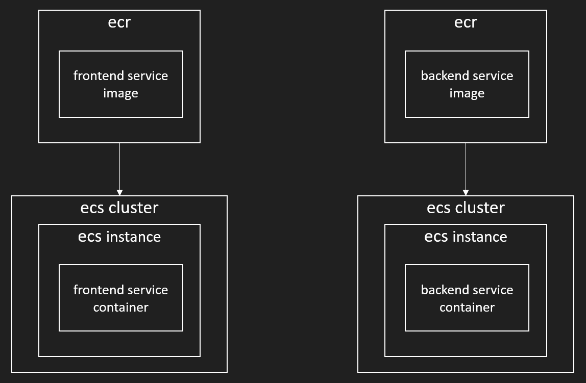

# air-labs

[project link](http://ec2-13-212-162-112.ap-southeast-1.compute.amazonaws.com/)

### technologies used 
- backend: java spring-boot 
- frontend: angular js
- contanerised in docker 
- deployed to AWS 
- bult in linux (ubuntu)

### project structure and diagrams
###### project strucre in java spring-boot: 

###### project strucre in full and github/github-actions: 

###### project strucre/architecture in aws: 

#### potential improvements 
- writing better tests 
  - tests currently are proof of concepts rather than actually ensuring the function of the project
- deployment
  - deployment to aws need to depend on the success/failure of the tests, rather than being conducted concurrently
  - explore deployment to aws using docker-compose rather than as two separate containers with two separate workflow files 
- security 
  - security was not considered at all during this project and it is a critical aspect that i need to explore and implement

###### if i were to redo this project: 
- conducting more research on the various tools available and evaluating them 
- better planning in terms of project structure and architecture 

#### what i learnt
- linux
  - setting up linux (ubuntu) in a virtual machine 
  - linux command line 
- github
  - cloning github repositories into local
  - git functions using terminal
  - setting up and configuring basic workflows 
- docker 
  - writing Dockerfiles/docker-compose.yml files to configure environments
  - building and running containers in linux 
- aws 
  - configuring aws-cli
  - pushing image to ecr 
  - creating ecs clusters, tasks, and services to deploy containers 
- testing
  - writing basic tests for java spring-boot
